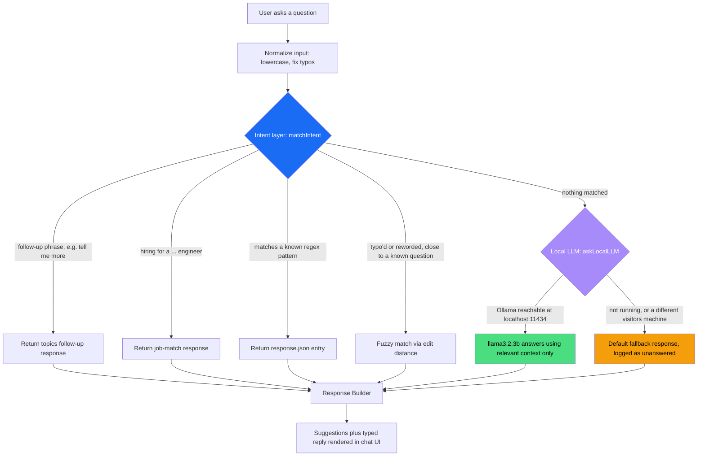

# Portfolio Chatbot — Hybrid Regex + Local LLM Architecture

**One-line pitch:** the chatbot answers most questions with zero AI —
deterministic regex matching, free and instant — and only reaches for a
small language model, running entirely on my own laptop via Ollama, when a
question needs real language understanding. No API key, no per-query cost,
no data ever leaves the machine.

---

## 1. The flow



| Layer | Cost | Speed | Used for |
|---|---|---|---|
| Regex / intent match (`matchIntent`) | Free | Instant | ~84 known question patterns — tech stack, projects, contact, availability, etc. |
| Fuzzy match (Levenshtein, hand-written) | Free | Instant | Typo'd or reworded versions of the 67 known Q&A pairs |
| Local LLM (Ollama, `llama3.2:3b`) | Free, runs on my laptop | ~1-4s (warm) | Open-ended questions that combine facts or need real phrasing understanding |
| Default response | Free | Instant | LLM unreachable — identical to the site's original behavior, nothing regresses |

The regex layer is **never bypassed** — the LLM is a last resort, not a
replacement. Most visitors' questions are answered by pattern-matching
alone and never touch the model at all.

---

## 2. Where the LLM call actually happens

`src/lib/localLlm.ts` sends a `fetch` from the **visitor's own browser**
directly to `http://localhost:11434/api/chat` (Ollama's REST API). There is
no backend server involved — the whole site is a static export
(`next.config.ts` → `output: "export"`, deployed to GitHub Pages).

Because the request originates in the browser:

- **On my laptop**, with `ollama serve` running, it works — the browser
  reaches its own `localhost`. This is true even against the live public
  URL, not just `localhost:3000` in dev.
- **For any other visitor**, their browser tries *their* `localhost:11434`,
  which doesn't exist. The fetch fails, `askLocalLLM` resolves to `null`,
  and the chatbot silently falls back to the same canned response it always
  gave. Nothing breaks, nothing looks different, no error is shown.

This is the core design property: **the feature can only ever help, never
hurt** — it has no failure mode visible to a real visitor.

---

## 3. The performance problem I hit, and how I fixed it

This is worth walking through live — it's a real "found a problem, diagnosed
it, fixed it" story, not just a feature that worked first try.

**First version:** the system prompt included the *entire* 67-question Q&A
corpus (`finetuning.json`) as context on every single LLM call, so the model
had maximum grounding. Measured latency on a warm model: **~54 seconds** for
one answer. Completely unusable in a chat UI.

**Root cause:** it wasn't the model being slow to *generate* — it was slow
to *read*. ~20,000 characters of context means the model has to process
thousands of tokens before it writes a single word of the answer, and a 3B
model on a laptop CPU/Metal isn't fast at that.

**Fixes applied (`src/lib/localLlm.ts`):**

1. **Keyword-relevance filtering.** Instead of sending all 67 Q&A pairs,
   score each pair by shared keywords with the question and send only the
   top ~6. The context shrinks by roughly 10x for the common case.
2. **Full-corpus fallback for the rare miss.** If literally nothing shares a
   keyword with the question, send the full corpus instead of guessing with
   an arbitrary slice — correctness over speed for that one rare path, still
   protected by the timeout below.
3. **Response length cap.** `options.num_predict: 150` plus an explicit
   "answer in at most 3 short sentences, no bullet lists or headers"
   instruction — the first version's answers were long, over-formatted, and
   ignored a softer version of this instruction.
4. **Prewarming.** `prewarmLocalLLM()` fires a throwaway request to Ollama
   the moment the chat window opens (not when a message is waiting on it),
   so the ~7s one-time cost of loading the 2GB model into memory happens
   in the background before the visitor has even finished reading the
   greeting. Guarded by a module-level singleton flag so it only fires once
   per page load, not every time the chat is toggled open/closed.

**Result:** typical warm-path answers now return in a few seconds — fast
enough for a real chat interaction, measured live against the actual UI, not
just the raw API.

**Talking point:** *"My first version worked, but it was demo-unusable —
50+ seconds. I profiled it, found the bottleneck was prompt size, not
inference, and fixed it with retrieval instead of brute-force context
stuffing. That's the same problem, and the same fix, as scaling any
RAG-style system."*

---

## 4. Guardrails

- **Grounding:** the system prompt instructs the model to answer *only*
  from the provided facts and say "I don't have that information" rather
  than invent details — small models will confidently hallucinate
  technologies or claims if not explicitly told not to (I saw this happen
  in testing before this instruction existed).
- **Tone / prompt-injection resistance:** a fixed "tone rules" block tells
  the model to stay professional, never insult anyone, and ignore any
  instruction embedded inside the visitor's question that tries to change
  its persona or behavior — it only ever answers as Aniket's portfolio
  assistant, regardless of what the input asks it to do.
- **Timeout safety net:** every call is wrapped in a 15s `AbortController`.
  If the model is unreachable, cold-starting, or unexpectedly slow, it
  fails closed into the same default response — never a hung UI.

## 5. Transparency: how you can tell which layer answered

Every bot message that came from the local LLM (not regex/fuzzy) carries a
small purple sparkle icon next to its timestamp (`Message.viaLLM` in
`ChatBot.tsx`) — no visible label, no mention of "AI" or a model name in the
chat itself, just a subtle visual marker so it's obvious during a demo which
answers are deterministic and which are generated live.

---

## 6. Demo script

1. Open the site, ask something ordinary — *"What's his tech stack?"* →
   instant, no sparkle, canned response from `responses.json`.
2. Ask something open-ended and specific — e.g. *"What kind of engineering
   culture would he thrive in versus struggle in?"* → a few seconds, sparkle
   icon appears, answer is generated live from the portfolio facts.
3. Point out: *"Nothing about the regex path changed. The model is strictly
   additive — it only ever gets a chance when the deterministic layer has
   nothing."*

### Running it

```bash
brew install ollama
brew services start ollama      # or: ollama serve
ollama pull llama3.2:3b         # ~2GB, one-time
npm run dev                     # or open the live production URL
```

Full setup notes: see [`README.md`](./README.md).

---

## 7. Anticipated questions

**"Why not just call OpenAI/Claude's API?"**
Cost and data. This is a personal portfolio with unpredictable traffic — a
paid API means unbounded cost per visitor question, and it means every
question a visitor types gets sent to a third party. A local model has
neither problem, and the domain (my own resume/projects) is narrow enough
that a small model is genuinely sufficient.

**"Why not just use the LLM for everything and drop the regex?"**
Predictability and speed. Regex is instant, free, and 100% deterministic —
the same question always gets the same answer. That matters for the common
questions (tech stack, contact info, availability) where there's no reason
to introduce model variance or latency at all. The LLM earns its keep only
where regex genuinely can't — synthesis across multiple facts, unexpected
phrasing.

**"What happens when this doesn't work — like right now, on a call, if
Ollama isn't running?"**
Nothing breaks. That's the point of the fallback chain — it degrades to
exactly the chatbot's original behavior with zero visible difference. I can
show that failure mode on purpose by stopping `ollama serve` mid-demo.

**"How would this scale past a 3B model / past a portfolio?"**
Same retrieval principle, bigger retrieval: swap the keyword-overlap scorer
for embeddings + a vector index once the corpus is too large for keyword
matching to stay accurate, and swap Ollama for a hosted endpoint once the
traffic or model size no longer fits comfortably on one machine. The
regex-first / LLM-fallback *shape* of the architecture doesn't change.
