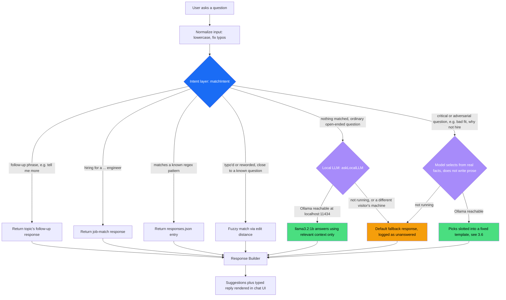

# Portfolio Architecture

Three parts: what the site is (Portfolio Design), how it's built and
deployed (Full Architecture), and the chatbot in full depth (Chatbot). The
chatbot is the most interesting engineering story here, but it sits inside
a real, deliberately-designed static site, not a standalone demo.

---

# Part 1: Portfolio Design

A single-page portfolio (`raianiket.github.io`) with two standalone routes,
assembled from independent section components in `src/app/page.tsx`:

```text
Preloader → Navbar → Hero → About → Projects → Skills → Experience →
Education → Contact → Footer
```

plus a layer of cross-cutting UX components that sit on top of that scroll,
not inside it: `ScrollProgress`, `BackToTop`, `CustomCursor`,
`SectionDots`, `SearchOverlay`, `WelcomeModal`, and `ChatBot`.

## 1.1 First-visit gate

On a first visit (tracked via `sessionStorage`, and always shown again in
dev), `WelcomeModal` asks a real design question before the visitor sees
anything else: *"How do you want to explore?"*, scroll the full portfolio,
or skip straight to asking the chatbot (`E` / `S` keyboard shortcuts work
too). Choosing the chatbot dispatches an event that opens it directly in
fullscreen, not the compact widget, since a visitor arriving through that
path clearly wants the chatbot to be the main event, not a corner
afterthought. This is a deliberate acknowledgment that a portfolio site has
two real audiences: someone who wants to read, and someone (often a
recruiter or interviewer, moving fast) who wants specific answers, and
forcing everyone through the same scroll-first experience serves neither
well.

## 1.2 Wayfinding

- **`⌘K` search** (`SearchOverlay`) searches project titles, categories,
  descriptions, and tags client-side, no network call, instant results.
- **`SectionDots`** gives a persistent scroll-position indicator down the
  side of the viewport, and **`ScrollProgress`** a top-of-page progress
  bar, so a long single-page scroll still has a sense of "how much is
  left."
- **`BackToTop`** and a **theme toggle** (dark/light, persisted to
  `localStorage`, otherwise following `prefers-color-scheme`) round out
  the navigation layer.

## 1.3 Standalone routes

- **`/resume`**: a print-optimized resume view with its own print bar
  (`ResumePrintBar`), for the "just give me a PDF" visitor.
- **`/pulse`**: a PIN-gated analytics dashboard (client-side PIN, not a
  real auth boundary, this is a personal-use view, not a secured
  admin panel) reading the Supabase events described in Part 2, showing
  page views, chatbot questions asked, which ones the bot couldn't answer,
  device/browser breakdown, and resume downloads.

## 1.4 The chatbot as a second front door

The chatbot (`ChatBot.tsx`) isn't a bolted-on widget, it's the alternate
path `WelcomeModal` explicitly offers on arrival. Both paths lead to the
same underlying content; the chatbot's job is to answer the same questions
the scroll answers, just faster and more specifically. Its full design is
Part 3.

---

# Part 2: Full Architecture

## 2.1 Stack

| Layer | Choice |
|---|---|
| Framework | Next.js 16, App Router, static export (`output: "export"`) |
| UI | React 19, TypeScript |
| Styling | Tailwind CSS + inline styles, `framer-motion` for animation |
| Icons | `lucide-react` |
| Analytics | Supabase (Postgres + client SDK), read and write from the browser |
| Hosting | GitHub Pages |

## 2.2 Static export, no backend

`next.config.ts` sets `output: "export"` (plus `trailingSlash: true` and
`images: { unoptimized: true }`, since GitHub Pages has no image
optimization server to call). The entire site, including `/resume` and
`/pulse`, builds down to static HTML/CSS/JS with no server-side rendering
and no API routes. There is no backend anywhere in this project, a
property Part 3 leans on directly for how the chatbot's local-LLM fallback
can exist at all without one.

## 2.3 Deployment

`.github/workflows/deploy.yml` runs on every push to `main`: checkout,
`npm ci`, `npm run build` (with `NEXT_PUBLIC_SUPABASE_URL` and
`NEXT_PUBLIC_SUPABASE_ANON_KEY` injected from GitHub Actions secrets at
build time, standard Next.js behavior bakes `NEXT_PUBLIC_*` values into
the static JS bundle, they're not secret at runtime), then
`upload-pages-artifact` and deploy to GitHub Pages. No manual deploy step,
no server to provision or keep alive.

## 2.4 Analytics, the one piece of shared state

`src/lib/track.ts` fires fire-and-forget Supabase inserts (page views,
project clicks, resume downloads, chatbot questions and whether they were
answered) tagged with a per-tab session ID (`sessionStorage`), and device/
browser info parsed from the user agent. `src/lib/supabase.ts` creates the
client from the env vars above with **no fallback on purpose**, a fork of
this repo without its own Supabase project should silently no-op instead
of writing into this project's database. `/pulse` reads the same table
back for the dashboard in section 1.3, and `Footer.tsx` does a small live
read of its own: it counts unique session IDs from `page_view` events and
only shows the visitor counter once it crosses 100, so the number never
displays as an awkward single digit early on.

This is the only piece of the whole site that talks to a real remote
service. Everything else, including the chatbot's primary answer path,
works with zero network calls.

## 2.5 Notable implementation details

A few specific, real choices worth knowing if asked about the site itself,
not the chatbot:

- **Anti-flash theming.** `layout.tsx` runs a small inline script that sets
  `data-theme` from `localStorage` before React hydrates, so there's no
  flash of the wrong theme on load.
- **Custom cursor.** A dual-layer cursor (`CustomCursor.tsx`, outer ring +
  inner dot, spring physics via `framer-motion`) that expands on hovering
  interactive elements and auto-disables on touch devices.
- **Hero.** A typewriter effect cycling through several role titles, and
  count-up stat animations triggered by `IntersectionObserver` when the
  section scrolls into view, both hand-implemented, no animation library
  beyond `framer-motion` for the transitions themselves.
- **Experience.** An accordion, the current role expanded by default,
  earlier roles collapse until clicked.
- **Skills.** Skill bars animate in on scroll, same `IntersectionObserver`
  pattern as the Hero stats.
- **Navbar.** Scroll-spy active-section highlighting, an `IntersectionObserver`
  per section decides which nav item is highlighted as you scroll.
- **Contact.** Copy-to-clipboard buttons for email and phone with their own
  transient "copied" state.
- **`FadeIn` / `FadeInStagger`.** A shared scroll-triggered fade-in
  primitive (`whileInView`, animates once) reused across every section
  instead of each one reimplementing its own entrance animation.

## 2.6 Project structure

```text
src/
  app/
    page.tsx        # home page (assembles the sections in 1.1)
    resume/         # standalone /resume route, print-friendly
    pulse/          # analytics dashboard (Supabase-backed)
  components/
    Hero, About, Projects, Skills, Experience, Education, Contact, Footer
    Navbar, Preloader, ScrollProgress, BackToTop, CustomCursor,
    SectionDots, SearchOverlay, WelcomeModal
    ChatBot.tsx      # the portfolio assistant, see Part 3
  data/
    responses.json   # chatbot regex patterns -> canned responses
    finetuning.json  # Q&A corpus used for fuzzy matching + LLM context
  lib/
    levenshtein.ts   # hand-written edit-distance fuzzy matcher, no dependency
    localLlm.ts      # local Ollama fallback for the chatbot
    supabase.ts, track.ts, ThemeContext.tsx, constants.ts
```

---

# Part 3: The chatbot

**One-line pitch:** the chatbot answers most questions with zero AI,
deterministic regex matching, free and instant, and only reaches for a
small language model, running entirely on my own laptop via Ollama, when a
question needs real language understanding. No API key, no per-query cost,
no data ever leaves the machine.

## 3.1 Design flow



Critical/adversarial questions are checked **before** the regex layer runs
at all, not after. That ordering is itself the result of a bug found during
live testing (3.3), a broad regex pattern kept accidentally intercepting
questions meant for the safer selection pipeline.

| Layer | Cost | Speed | Used for |
|---|---|---|---|
| Regex / intent match (`matchIntent`) | Free | Instant | 85 known question patterns: tech stack, projects, contact, availability, etc. |
| Fuzzy match (Levenshtein, hand-written) | Free | Instant | Typo'd or reworded versions of the 107 known Q&A pairs |
| Local LLM (Ollama, `llama3.2:1b`) | Free, runs on my laptop | ~1-4s warm | Open-ended questions that combine facts or need real phrasing understanding |
| Default response | Free | Instant | LLM unreachable, identical to the site's original behavior, nothing regresses |

The regex layer is **never** the source of truth for critical questions,
and never bypasses the LLM entirely. Most visitors' questions are answered
by pattern-matching alone and never touch the model at all.

## 3.2 Where the LLM call actually happens

`src/lib/localLlm.ts` sends a `fetch` from the **visitor's own browser**
directly to `http://localhost:11434/api/chat` (Ollama's REST API), using
the same "no backend" property from Part 2. There is nothing on the server
side to call.

Because the request originates in the browser:

- **On my laptop**, with `ollama serve` running, it works: the browser
  reaches its own `localhost`. This is true against the live public URL,
  not just `localhost:3000` in dev, once Ollama's CORS config explicitly
  allows the production origin (3.3 covers why that wasn't automatic).
- **For any other visitor**, their browser tries *their* `localhost:11434`,
  which doesn't exist. The fetch fails, `askLocalLLM` resolves to `null`,
  and the chatbot silently falls back to the same canned response it always
  gave. Nothing breaks, nothing looks different, no error is shown.

This is the core design property: **the feature can only ever help, never
hurt**, it has no failure mode visible to a real visitor.

## 3.3 Case study: what live-testing on the real deployment found

Everything in 3.4 through 3.6 was built and passing locally before any of
this. Testing it against the actual hosted URL, not just `localhost:3000`,
found real bugs a local dev-server check never would have. This is the
part worth walking through live if there's time.

**1. It worked in dev and silently failed in production.** Ollama's default
config only accepts requests from `localhost` origins. `localhost:3000`
happens to qualify; `https://raianiket.github.io` doesn't. Every test up to
that point had been against the dev server, so this never surfaced until
the actual hosted site was checked, where the LLM fallback was quietly
returning nothing. Fixed by adding the production origin to
`OLLAMA_ORIGINS`, baked into the Ollama service config so it survives a
restart or reboot rather than needing to be re-set by hand.

**2. The flagship question itself was broken.** "What would make him a bad
fit for a chaotic early-stage startup," the exact scenario the selection
pipeline in 3.6 exists for, was returning the generic "I don't have that
information" fallback. Root cause: the model sometimes reuses the CONCERN
list's "0 means none" convention on the EVIDENCE or VALIDATE slots, which
have no such option, and the original code discarded the entire answer
over one stray digit instead of just that slot. Fixed by clamping each
slot into its valid range instead of failing closed on a partial parse.

**3. Edit distance doesn't understand negation.** "Why shouldn't we hire
Aniket?" was fuzzy-matching (86% similarity) onto the training example "why
should we hire Aniket" and returning the positive answer, sentiment
inverted. Edit distance treats "shouldn't" and "should" as nearly identical
strings since the difference is only a few characters, even though they
mean opposite things. Fixed by only letting a critical/adversarial question
fuzzy-match against other critical/adversarial training examples, never a
positively-framed one.

**4. One overbroad pattern after another.** Several separate regex patterns
(an achievements pattern matching `good.*fit`, an about-page pattern
matching bare `what does aniket`, a leadership pattern matching bare
`team`) each independently swallowed a critical/comparative question and
returned an unrelated canned answer instead of real reasoning. Patching
each one as it was found was treating the symptom. The actual fix was
structural: critical questions now skip the regex layer entirely (see the
flow diagram in 3.1), so no future pattern can accidentally intercept one,
rather than auditing every existing and future pattern by hand.

**Result of this pass:** the training corpus grew from 67 to 107 examples,
specifically filling gaps this testing exposed (personal projects that had
zero coverage, comparative "startup vs. MNC" style questions that kept
surfacing new regex and fuzzy-match bugs), and the critical-question
pipeline is now structurally protected rather than protected by the
absence of a colliding pattern so far.

## 3.4 The latency problem, and the fix

The first working version included the *entire* Q&A corpus as context on
every LLM call, for maximum grounding. Measured latency on a warm model:
**~54 seconds** for one answer, unusable in a chat UI.

**Root cause:** the model wasn't slow to *generate*, it was slow to *read*.
~20,000 characters of context means processing thousands of tokens before
writing a single word of the answer, regardless of model size.

**Fixes applied (`src/lib/localLlm.ts`):**

1. **Keyword-relevance filtering.** Score each Q&A pair by shared keywords
   with the question, send only the top ~6. Context shrinks roughly 10x for
   the common case.
2. **Full-corpus fallback for the rare miss.** If nothing shares a keyword
   with the question, send the full corpus rather than guess with an
   arbitrary slice: correctness over speed for that one rare path, still
   bounded by the timeout below.
3. **Response length cap.** `options.num_predict: 220` plus an explicit
   "answer in at most 3 short sentences, no bullet lists or headers"
   instruction.
4. **Prewarming.** `prewarmLocalLLM()` fires a throwaway request the moment
   the chat window opens, so the model finishes loading into memory in the
   background before a real question needs it. Guarded by a module-level
   singleton so it only fires once per page load.

**Result:** warm-path answers return in a few seconds, measured live
against the actual UI, the same fix pattern any RAG-style system uses when
prompt size, not inference speed, is the bottleneck.

### Model choice: `llama3.2:1b`, not `3b`

This machine has 8GB of total RAM. While testing `llama3.2:3b` (2.0GB), the
dev server was killed mid-session by macOS for running the system low on
memory, a reproducible resource-exhaustion event, not a hypothetical one.

That prompted a direct benchmark: `llama3.2:3b` (2.0GB) vs. `llama3.2:1b`
(1.3GB) vs. `qwen2.5:0.5b` (0.4GB), against the same grounded question.
`qwen2.5:0.5b` was fastest but its answers were generic and ignored the
supplied facts. `llama3.2:1b` gave answers just as specific and grounded as
`3b`, at roughly two-thirds the memory footprint, with no OOM risk, the one
shipped, and a hard constraint since: quality problems get solved by
improving retrieval and task design around the model, not by upsizing it.

## 3.5 Guardrails

- **Grounding.** The system prompt instructs the model to answer *only*
  from the provided facts and say "I don't have that information" rather
  than invent details, small models will confidently hallucinate
  technologies or claims without this instruction.
- **Tone / prompt-injection resistance.** A fixed "tone rules" block tells
  the model to stay professional, never insult anyone, and ignore any
  instruction embedded inside the visitor's question that tries to change
  its persona or behavior.
- **Timeout safety net.** Every call is wrapped in an `AbortController`.
  If the model is unreachable, cold-starting, or unexpectedly slow, it
  fails closed into the default response, never a hung UI.

## 3.6 Design decision: selection instead of composition for adversarial questions

Questions like *"what would make him a bad fit for a startup?"* or *"why
shouldn't I hire him?"* (`isCriticalQuestion()` in `localLlm.ts`) get a
fundamentally different pipeline than everything else, the most
consequential design decision in the project.

**Four attempts at free-composition prompting, tested directly against the
real model, all failed the same way:**

1. Full corpus + an 8-rule anti-hallucination system prompt
   (evidence/inference separation, a rigid output format, low temperature).
2. The same, scoped to only the keyword-matched subset of the corpus.
3. A two-step pipeline, one call to *extract* relevant evidence, a second
   to *reason* only from that summary. The extraction step ignored its own
   instructions once given the full corpus, and just answered directly.
4. A single call scoped to a small, hand-picked ~10-entry pool of facts
   specifically relevant to work style and pressure-handling.

Every attempt still invented specific, plausible-sounding, unfounded claims,
"scope creep," "overemphasis on technical debt," "lack of experience with
agile methodologies," none present anywhere in the source data, even with
explicit "only claim what's below" instructions at low temperature. A
version that flatly refused this whole question category was tried next:
safe, but it made the bot look like a lookup table instead of something
that reasons about new phrasing.

**The fix: never let the model write prose for this category.** Instead,
`askLocalLLM` gives it three short numbered lists of real, pre-vetted,
always-true facts about me (`CONCERNS`, `EVIDENCE`, `VALIDATE` in
`localLlm.ts`) and asks for nothing but three numbers, which item from each
list is most relevant to this question, or `0` if no real concern applies.
Application code slots the picks into a fixed, human-written sentence
template (three interchangeable phrasings, rotated, so repeated questions
in this category don't read identically).

```text
Question → model picks (concern #, evidence #, validate #) → template
```

Selection is a categorically easier task for a small model than open
writing: its picks vary sensibly by question, correctly returning `0` (no
concern) for non-negative questions, with reasonable picks otherwise, but
it can only ever select a true, real statement, never invent new content.
The worst-case failure mode moved from *fabricated claim* to
*slightly-less-than-optimal but still true choice*, a fundamentally safer
place to fail for something representing a real person to a recruiter. It's
also faster: pure number selection runs in roughly a second, versus several
seconds for full-paragraph generation.

The constraint that shaped this: `llama3.2:1b` stays a hard requirement,
local execution, low RAM, no paid API. Given that constraint, the fix had
to be architectural (change what the model is asked to do), not a matter of
throwing more parameters at the same free-composition task.

## 3.7 Transparency: how you can tell which layer answered

Every bot message generated by the local LLM (not regex or fuzzy match)
carries a small purple sparkle icon next to its timestamp (`Message.viaLLM`
in `ChatBot.tsx`), no visible label, no mention of "AI" or a model name in
the chat itself, just a subtle visual marker distinguishing deterministic
answers from generated ones. The chat panel also has a fullscreen toggle in
the header for switching between the compact widget and the larger
first-visit layout without losing the conversation.

## 3.8 FAQ

**Why not just call OpenAI's or Claude's API?**
Cost and data. This is a personal portfolio with unpredictable traffic, a
paid API means unbounded cost per visitor question, and every question a
visitor types would get sent to a third party. A local model has neither
problem, and the domain (my own resume and projects) is narrow enough that
a small model is genuinely sufficient.

**Why not use the LLM for everything and drop the regex?**
Predictability and speed. Regex is instant, free, and fully deterministic,
the same question always gets the same answer, which matters for common
questions (tech stack, contact info, availability) where there's no reason
to introduce model variance or latency. The LLM earns its keep only where
regex genuinely can't reach: synthesis across facts, unexpected phrasing.

**What happens if Ollama isn't running?**
Nothing breaks. The fallback chain degrades to exactly the chatbot's
original behavior with zero visible difference to a visitor.

**How would this scale past a 1B model, or past a portfolio's worth of
content?**
Same retrieval principle, bigger retrieval: swap the keyword-overlap scorer
for embeddings and a vector index once the corpus outgrows keyword matching,
and swap Ollama for a hosted endpoint once traffic or model size no longer
fits one machine. The regex-first, LLM-fallback shape of the architecture
doesn't change.

**How does the chatbot handle adversarial questions about weaknesses or fit?**
Through a different pipeline than every other open-ended question (3.6):
the model only picks from pre-vetted true facts, and never writes free
prose for this category, the specific design decision that came out of
four failed attempts at the more obvious approach.

**Did this actually get tested, or does it just work in theory?**
3.3. Testing it against the real hosted URL (not just dev) found and fixed
a production-only CORS failure, a broken flagship answer, a
sentiment-inversion bug, and three separate overbroad regex patterns, each
fixed by tracing to the actual root cause rather than patching the symptom.

**Why does the site have a Supabase dependency if it's meant to have no
backend?**
It's analytics only (Part 2.4), and the site
functions identically with it absent, `track()` no-ops safely with no env
vars set. It's not in the request path for anything a visitor actually
sees or does.
